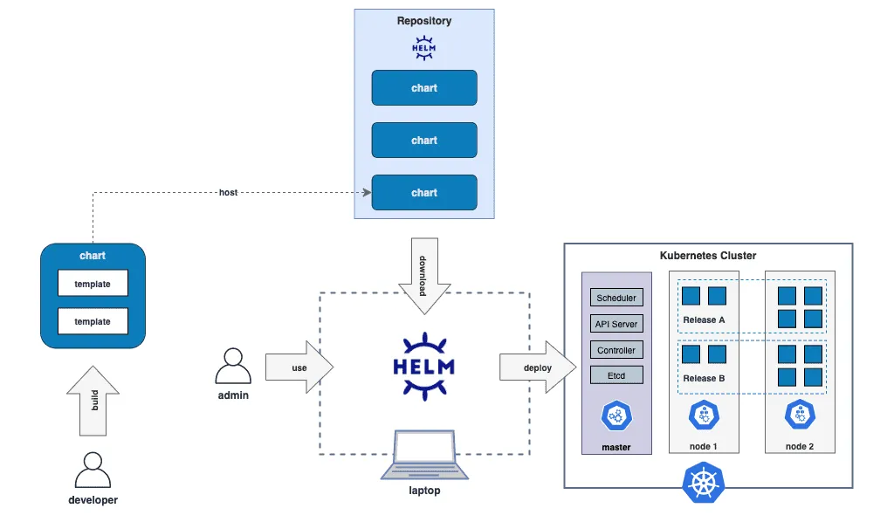

  <h1 align="center">Helm Kubernetes Package Manager</h1>
  

    <a href="README.md"><strong>English</strong></a> | <strong>简体中文</strong>
  

## Table of Contents

- [Repository Introduction](#repository-introduction)
- [Prerequisites](#prerequisites)
- [Image Specifications](#image-specifications)
- [Getting Help](#getting-help)
- [How to Contribute](#how-to-contribute)

## Repository Introduction
‌[Helm‌](https://github.com/helm/helm) Helm is a package manager for Kubernetes, designed to simplify the deployment and management of applications through templated, versioned, and shareable "Charts".

**Core Features:**
1. **Template-based Deployment Management**: Helm uses a templating mechanism to dynamically generate Kubernetes resource configuration files (YAML), supporting variable injection (Values.yaml), conditional statements, and loop control, thereby decoupling application configuration from deployment logic. For example, the number of application replicas can be dynamically adjusted using `{{.Values.replicaCount }}`, avoiding manual modifications across multiple environments.
2. **Dependency Management (Charts)**: Applications and their dependencies (such as MySQL, Redis, etc., as sub-Charts) are defined through Charts, which support dependency version locking and recursive updates. Chart repositories (Repository) facilitate centralized storage and sharing of application templates, such as adding public repositories via `helm add repo` and deploying pre-configured applications (like Jenkins, Nginx Ingress).
3. **Versioning and Rollback (Release Management)**: Each deployment generates a unique version number (Release), records configuration history, and supports one-click rollback to any historical version (e.g., `helm rollback my-app 1`). Version differences can be visually compared using the `helm diff` plugin, ensuring traceability of changes.
4. **Lifecycle Hooks**: Hooks such as pre-install and post-upgrade are supported to execute custom operations at critical deployment stages (e.g., database migration or validation). These hooks are implemented based on Kubernetes Job/CronJob, ensuring that dependent services are ready before deploying the application.
5. **Value File Overrides and Multi-environment Adaptation**: Dynamic overrides of template parameters are supported through the `--set` command-line parameter or external value files (Values.yaml), adapting to configuration differences across development, testing, and production environments. For example, `helm install my-app --set image.tag=latest` takes precedence over default values.
6. **Security and Permission Control**: Integrated with Kubernetes RBAC, it supports fine-grained ServiceAccount permissions (e.g., restricting the namespace for Chart installation). Chart syntax can be validated using `helm lint`, and Chart digital signatures (based on PGP) can be verified using `helm verify`, ensuring deployment security.
7. **Ecosystem and Extensibility**: It provides a plugin system (Plugins) and SDK extension capabilities (such as Helm Dashboard). The community maintains a large number of stable Charts (like Bitnami, Azure official library), supports custom Chart development, and distributes them through OCI registries.
8. **Declarative Deployment and GitOps Integration**: The generated Release status is stored in Kubernetes Secret/C.

This project offers pre-configured [**`Helm-Kubernetes Package Manager`**]()，images with Helm and its runtime environment pre-installed, along with deployment templates. Follow the guide to enjoy an "out-of-the-box" experience.

**Architecture Design:**

> **System Requirements:**
> - CPU: 4vCPUs or higher
> - RAM: 16GB or more
> - Disk: At least 50GB

## Prerequisites
[Register a Huawei account and activate Huawei Cloud](https://support.huaweicloud.com/usermanual-account/account_id_001.html)

## Image Specifications

| Image Version          | Description | Notes |
|------------------------| --- | --- |
| [Helm-3.18.6-kunpeng-v1.0](https://github.com/HuaweiCloudDeveloper/helm-image/tree/Helm-3.18.6-kunpeng-v1.0?tab=readme-ov-file) | Deployed on Kunpeng servers with Huawei Cloud EulerOS 2.0 64bit |  |

## Getting Help
- Submit an [issue](https://github.com/HuaweiCloudDeveloper/helm-image/issues)
- Contact Huawei Cloud Marketplace product support

## How to Contribute
- Fork this repository and submit a merge request.
- Update README.md synchronously based on your open-source mirror information.